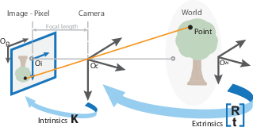

# 相机标定原理与c++实现（张氏标定法）

## 前言

最近在做相机标定方面的工作，虽然以前多次进行相机标定，但是多数时候是调用opencv的函数，过程相对简单。虽然对标定过程有一定的了解，但是掌握的不是很扎实，所以趁这次机会，对相机标定过程做了一下深入的了解，并且用c++重新实现了下整个标定过程（opencv 中有源码，但是有点乱我没太看懂，有可能我比较渣渣），所以这是篇学习笔记。其中有些自己的理解，所以难免有错误的地方，还望指正，抱拳。

小学时候大家都做过小孔成像实验，当孔足够小的时候，在小孔的另一端我们能看到物体的倒立成像，但是当小孔变大的时候图像的不同部分发出的光线会在孔另一端的屏幕上重叠成像就不清晰了。现代相机正是依据小孔成像原理制作的，由于亮度等其他原因，使用镜头代替了小孔。同时镜头又给成像带来了其他问题，比如说畸变。

## 标定的目的

相机的作用是把看到的3D世界转换成2D图像，相当于我的输入是三维数据经过一个函数把他变成二维数据。我们想找到这个理想的函数，那么从数学角度先对这个问题进行建模，也就是相机的成像模型+畸变模型，而标定的目的就是通过观察到的数据，去无线逼近这个函数，也就是逼近这个理想模型的参数。

## 相机模型（透视投影模型，成像过程）

在看相机模型前先明确几个坐标系

__世界坐标系：__ 单位m，三维世界的坐标系，用户在描述真实世界位置而引入的坐标系，后面我们把棋盘板坐标系看作世界坐标系。

__相机坐标系：__ 单位m，通常原点在光心，z轴与光轴平行，为了描述物体和相机的相对位置而引入。

__图像坐标系：__ 单位m，原点位于sensor中心，比如ccd相机的sensor中心，xy轴分别平行于sensor的两个边。

__像素坐标系：__ 单位像素，这个是我们最常见的用于描述图片的，比如从相机读取出来的图片，原点在图片左上角。



图1

[source:mathworks](https://ww2.mathworks.cn/help/vision/ug/camera-calibration.html)

上图是各坐标系间的关系，$O_w$为世界坐标系，$O_c$（图中$\alpha$处）为相机坐标系，$O_i$为图像坐标系，$O_p$为像素坐标系，下面逐步分析坐标系间的转换关系。

### 世界坐标系 -> 相机坐标系

世界坐标系到相机坐标系是一个刚体变换过程，刚体变换可以用一个旋转矩阵（_也可以为旋转向量、欧拉角、四元数,程序中对外参进行优化时就是利用旋转向量这种紧凑的表示方法进行优化，后文会提到_）和平移向量来表示。

$$ \left[\begin{array}{c}
x_c \\
y_c\\
z_c\\
1\\
 \end{array}\right]=\underbrace{\left[\begin{array}{cccc}
r_{11} & r_{12} & r_{13} & t_{x} \\
r_{21} & r_{22} & r_{23} & t_{y} \\
r_{31} & r_{32} & r_{33} & t_{z} \\
0 & 0 & 0 & 1
\end{array}\right]}_W \cdot\left[\begin{array}{l}
x_w \\
y_w \\
z_w \\
1
\end{array}\right] \quad \cdots 式1$$

$r_{3\times3}$为旋转矩阵，$t_{3\times1}$为平移向量。这个刚体变换矩阵$W$就是我们常说的相机外参，和相机本身没有太大关系。至此我们得到了世界坐标系到相机坐标系下的变换关系：
$$P_c = W \cdot P_w$$
本文中以标定版坐标系为世界坐标系，所以$z_w=0$,所以$W$的第三列可以省略，用更紧凑的形式表示。


### 相机坐标系 -> 理想无畸变的图像坐标系


图2

[source:opencv](https://docs.opencv.org/2.4/modules/calib3d/doc/camera_calibration_and_3d_reconstruction.html)

图中蓝色的坐标轴（xy）是图像坐标系，橘黄色的坐标轴（uv）为像素坐标系，两个坐标系重合并且和相机坐标系（$F_c,$）处在同一侧,这里可能会造成一些疑惑，实际相机的成像是在光心（相机坐标系原点）的另一侧（对称），也就是在sensor成倒立图像，但是为了数学上的方便描述和计算方便，所以对图像坐标系做了个对调。

根据相似三角形原理，图像坐标系下点$P$，焦距$f$,可得到对应的相机坐标系下的点为：

$$x=f \cdot \frac{X}{Z} \quad y=f \cdot \frac{Y}{Z} \quad \cdots 式2$$

向量话形式为：

$$p=\left[\begin{array}{l}
x \\
y
\end{array}\right]=\frac{f}{Z} \cdot\left[\begin{array}{l}
X \\
Y
\end{array}\right] \quad \cdots 式3$$

式2，3是在笛卡尔坐标系下对透视变换的描述（非线性变换），我们也可以在齐次坐标系下对这个过程进行线性描述。
$$\underbrace{\left[\begin{array}{l}
x \\
y
\end{array}\right]}_p = \frac{f}{Z} \cdot\left[\begin{array}{c}
X \\
Y
\end{array}\right] \equiv\left[\begin{array}{c}
f X / Z \\
f Y / Z \\
1
\end{array}\right] \equiv\left[\begin{array}{c}
f X \\
f Y \\
Z
\end{array}\right]=\underbrace{\left[\begin{array}{cccc}
f & 0 & 0 & 0 \\
0 & f & 0 & 0 \\
0 & 0 & 1 & 0
\end{array}\right]}_{\mathbf{M}_{\mathrm{P}}} \cdot \underbrace{\left[\begin{array}{l}
X \\
Y \\
Z \\
1
\end{array}\right]}_{P_c}$$

其中：

$$\mathbf{M}_{\mathrm{P}}=\left(\begin{array}{cccc}
f & 0 & 0 & 0 \\
0 & f & 0 & 0 \\
0 & 0 & 1 & 0
\end{array}\right)=\underbrace{\left(\begin{array}{ccc}
f & 0 & 0 \\
0 & f & 0 \\
0 & 0 & 1
\end{array}\right)}_{\mathbf{M}_{f}} \cdot \underbrace{\left(\begin{array}{cccc}
1 & 0 & 0 & 0 \\
0 & 1 & 0 & 0 \\
0 & 0 & 1 & 0
\end{array}\right)}_{\mathbf{M}_{0}}$$

$M_f$为理想的焦距为$f$的针孔相机模型，且$M_0$通常被称为standard (or
canonical) projection matrix.至此，我们得到了从相机坐标系到理想图像坐标系的转化关系：
$$
p = M_p \cdot P_c
$$

### 图像坐标系 -> 像素坐标系

上面我们得到了点在相机坐标系下的坐标，要想得到实际图片的坐标的话，还要进行进一步的变换，可以理解为仿射变换。那么我们需要知道，xy方向上两个坐标系的尺度变换系数；由于像素坐标系的原点在图像的左上角，而图像坐标系的原点在图像的中心$(u_c,v_c)$。所以，我们引入尺度因子$s$,$s_x=1/d_x$，$d_x$为$x$方向上像素的尺寸（最小感光元件的尺寸，单位为$m$）,那么我们可以得到像素坐标系下的坐标为：

$$
\left[ \begin{array}{c}
u\\v\\1
\end{array}
 \right]=
\left[\begin{array}{ccc}
s_{x} & 0 & u_{c} \\
0 & s_{y} & v_{c} \\
0 & 0 & 1
\end{array}\right] \cdot \underbrace{ \left[
\begin{array}{c}
x\\y\\1   
\end{array} \right]}_p
$$

### 相机坐标系->实际的图像坐标系

__相机的畸变过程就发生在相机坐标系到图像坐标系这个变换过程__，所以我们也是在这个过程中引入畸变模型。相机畸变主要分为两类，径向畸变和切向畸变。径向畸变是由于透镜形状的制造工艺导致。且越向透镜边缘移动径向畸变越严重。

$$\left\{\begin{array}{l}
\mathrm{x}_{rcorr}=x_{p}\left(1+k_{1} r^{2}+k_{2} r^{4}+k_{3} r^{6}\right) \\
y_{rcorr}=y_{p}\left(1+k_{1} r^{2}+k_{2} r^{4}+k_{3} r^{6}\right)
\end{array}\right.$$
切向畸变是由于透镜和CMOS或者CCD的安装位置误差导致。切向畸变需要两个额外的畸变参数来描述，矫正前后的坐标关系为：
$$\left\{\begin{array}{l}
\mathrm{x}_{tcorr}=x_{p}+\left[2 p_{1} x_{p} y_{p}+p_{2}\left(r^{2}+2 x_{p}^{2}\right)\right] \\
\mathrm{y}_{tcorr}=y_{p}+\left[p_{1}\left(r^{2}+2 y_{p}^{2}\right)+2 p_{2} x_{p} y_{p}\right]
\end{array}\right.$$

所以，现在我们需要五个参数来描述相机的畸变，我们可以用下式来表示：
$$\tilde{\boldsymbol{x}}=\operatorname{warp}(\boldsymbol{x}, \boldsymbol{k},\boldsymbol{p})$$

### 投影过程总结

$$\left[\begin{array}{l}
u \\
v \\
1
\end{array}\right]=
\underbrace{\left[\begin{array}{lll}
s_{x} & 0 & u_{c} \\
0 & s_{y} & v_{c} \\
0 & 0 & 1
\end{array}\right] 
\cdot\underbrace{\left(\begin{array}{lll}
f & 0 & 0 \\
0 & f & 0 \\
0 & 0 & 1
\end{array}\right)}_{\mathbf{M}_{f}}}_A \cdot 
\operatorname{warp}(\boldsymbol{x}, \boldsymbol{k}, \boldsymbol{p})\cdot
\underbrace{\left(\begin{array}{llll}
1 & 0 & 0 & 0 \\
0 & 1 & 0 & 0 \\
0 & 0 & 1 & 0
\end{array}\right)}_{\mathbf{M}_{0}}\cdot

\underbrace{\left[\begin{array}{cccc}
r_{11} & r_{12} & r_{13} & t_{x} \\
r_{21} & r_{22} & r_{23} & t_{y} \\
r_{31} & r_{32} & r_{33} & t_{z} \\
0 & 0 & 0 & 1
\end{array}\right]}_{W} \cdot\left[\begin{array}{l}
x_{w} \\
y_{w} \\
z_{w} \\
1
\end{array}\right]$$

上式中不是严格的矩阵乘法，其中涉及极坐标化等。其中$A$即为内参矩阵，$k,p$为畸变系数，$W$为外参。

## 标定过程

我们已经了解了相机投影模型，下面我们来看下怎么对未知参数进行标定。首先我们用相机采集不同姿态标定板的图像，标定板上带有明显视觉特征点。其中我们以标定板左上角角点为原点，垂直于标定板平面方向为z轴，建立世界坐标系，这样我们就能得到特征点在世界坐标系下的坐标和其在像素坐标系下的坐标。整个过程可分为五部分。

#### 1. 求单映性矩阵（homography）

单映性矩阵用来描述两个平面上的点的映射关系，结合前文提到的图像坐标系到像素坐标系的映射关系，我们有：

$$
\left[\begin{array}{l}
u \\
v \\
1
\end{array}\right] =
\lambda
\underbrace{\left[\begin{array}{lll}
f\cdot s_{x} & 0 & u_c \\
0 & f\cdotp s_{y} & v_c \\
0 & 0 & 1
\end{array}\right]}_A\left[\begin{array}{lll}
r_{11} & r_{12} & t_x \\
r_{21} & r_{22} & t_y \\
r_{31} & r_{32} & t_z \\
\end{array}\right]\left[\begin{array}{l}
x_w \\
y_w \\
1
\end{array}\right]
$$
设$H=\left[h1,h2,h3\right]=\lambda\cdotp A\cdot[r_1,r_2,t]$，因为H为3x3矩阵，且参与计算的坐标为其次坐标，所以H有八个自由度，所以一个点对对应两个方程，所以大斯鱼等于四个点即可计算出H矩阵。标定版的特征点一般大于四个，有利于H的优化和数值的稳定；求解H一般情况下使用normalized DLT 算法[1][2]；每个姿态的图像都能计算出一个单映性矩阵，我们可以用已知的点对对H进一步优化，本文使用ceres[4]非线性优化库进行求解。

```c++
void get_homography(std::vector<Eigen::Matrix3d> &vec_h_)
{
    vec_h_.clear();
    for (int i=0;i<_imgs_pts.size();++i)
    {
        Eigen::Matrix3d ini_H,refined_H;
        estimate_H(_imgs_pts[i], _boards_pts[i], ini_H);
        optimier.refine_H(_imgs_pts[i], _boards_pts[i], ini_H,refined_H);
        vec_h_.push_back(refined_H);
    }
}
```
#### 2.计算内参矩阵 
H已知，H可以分解为下式：
$h_1=\lambda \cdot A \cdot r_1 \Rightarrow r_1=s\cdot A^{-1}\cdot h_1$
$h_2=\lambda \cdot A \cdot r_2 \Rightarrow r_2=s\cdot A^{-1}\cdot h_2$
$h_3=\lambda \cdot A \cdot t \Rightarrow t=s\cdot A^{-1}\cdot h_3$

由于$r_1,r_2$为旋转矩阵的两列，所以可以引入两个约束：
- $r_1,r_2$正交:$r_1^T\cdot r_2=r_2^T\cdot r_1=0$
- $r_1,r_2$的模为1:$|r_1|=|r_2|=1$

用h的展开式替换约束条件中的h：

- $r_1^{T}\cdot r_2=h_{1}^{T}\left(A^{-1}\right)^{T} A^{-1} h_{2}=0$
- $h_{1}^{T}\left(A^{-1}\right)^{T} A^{-1} h_{1}=h_{2}^{T}\left(A^{-1}\right)^{T} A^{-1} h_{2}$


#### 3.计算外参矩阵 

#### 4.计算畸变参数

#### 5.优化所有参数

## 参考文献

[1] Burger, Wilhelm. "Zhang’s camera calibration algorithm: in-depth tutorial and implementation." Hagenberg, Austria (2016).
[2] 多视角几何
[3] https://zhuanlan.zhihu.com/p/24651968
[4] http://ceres-solver.org/index.html